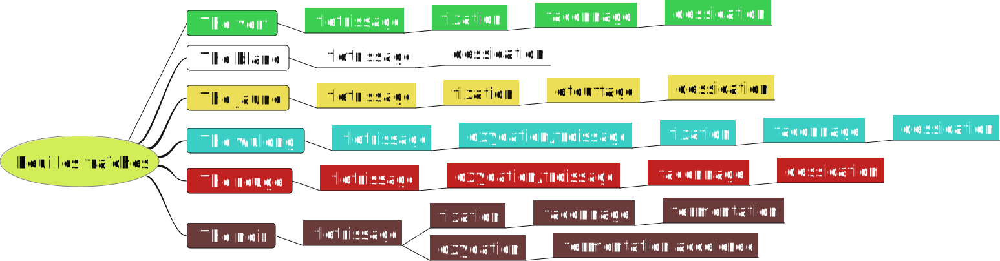

## Processus de fabrication du thé

Les étapes de fabrication du thé constituent le processus par laquelle les feuilles de _camellia sinensis_ sont transformées de la cueillette jusqu'à l'infusion.
  
En Chine, les artisan·e·s du thé affinent les techniques de fabrications depuis des millénaires. Dans chaque région des méthodes uniques pour la culture et l'artisanat du thé sont explorées. La variation des goûts et des techniques locales a été et reste le moteur de l'innovation.  

La description des étapes proposée ici est très réductrice, elle généralise en laissant de côté des spécificités essentielles comme  _l'assemblage_, les _morsures d'insectes_ et mille autres étapes. Si elle nous éloigne de la complexité réelle, elle permet peut-être un point de départ pour embarquer vers un peu plus de compréhension.

> Pour la plupart des cultures, les dégâts causés par les insectes sont une mauvaise chose - tant pour le rendement que pour la qualité. Dans le cas du thé, cependant, nous avons quelque chose d'unique avec les thés dits "mordus par des insectes". L'attaque d'un insecte améliore la qualité en induisant des modifications chimiques qui améliorent l'arôme du thé - [^1]

### Les différentes étapes

 [^2]

- **La cueillette** [^3] : Les bourgeons de thé et/ou deux jeunes feuilles sont cueillies sur les buissons de _Camellia Sinensis_ principalement au printemps et début de l'été et plus rarement en automne  
- **Flétrissage** [^4] : Les feuilles de thé commencent à se flétrir peu après la cueillette, avec un début progressif d'oxydation enzymatique. Le flétrissage est utilisé pour éliminer l'excès d'eau des feuilles et permet une très légère oxydation. Les feuilles peuvent être soit mises au soleil, soit laissées dans une pièce fraîche et brillante
  
- **Oxydation** [^5] : Les feuilles sont parfois cassées pour favoriser l'oxydation. Elles peuvent être simplement secouées ou bien elles sont abîmées en les pétrissant ou en les roulant par exemple [^6]. Elles sont ensuite laissées dans une pièce climatisée où elles deviennent progressivement plus foncées. Dans ce processus, la chlorophylle des feuilles est décomposée par les enzymes et ses tannins sont libérés ou transformés. Ce processus est parfois appelé à tort fermentation dans l'industrie du thé.
  
- **Fixation** [^7] : La fixation est effectuée pour arrêter l'oxydation des feuilles de thé à un niveau souhaité. Ce processus est accompli en chauffant modérément les feuilles de thé, ce qui désactive leurs enzymes oxydantes et élimine les odeurs indésirables dans les feuilles, sans endommager la saveur du thé. Traditionnellement, les feuilles de thé sont cuites à la poêle dans un wok ou à la vapeur et plus récemment dans un tambour à rouler

- **Étouffage** [^8] : Les feuilles chaudes et humides sont enveloppées dans du tissu ou du papier ou entassées dans un panier en bambou recouvert d'un tissu et sont laissées pendant quelques heures ou quelques jours, ce qui démarre un léger processus de fermentation. En étant étouffés les acides aminés et les polyphénols des feuilles de thé transformées subissent des modifications chimiques ce qui provoque le jaunissement des feuilles

- **Façonnage** [^9] : Les feuilles de thé humides sont ensuite roulées à la main ou à l'aide d'une machine à rouler qui fait s'enrouler le thé sur lui-même. Ce roulage fait également suinter une partie de la sève, des huiles essentielles et des jus contenus dans les feuilles, ce qui rehausse le goût. Les feuilles peuvent ensuite être façonnées en d'autres formes, par exemple roulées en perles et autres formes élaborées. Le thé peut également être pressé à l'aide de pierres lourdes ou de presses
  
- **Séchage** [^10] : Tous les thés doivent passer par cette étape pour être considérés comme stables. Le séchage permet de réduire le niveau d'humidité dans les feuilles de thé à 2-3%. Ce faisant, les feuilles sont stables et le processus d'oxydation des feuilles est presque entièrement stoppé. Un séchage trop lent du thé entraîne une détérioration des arômes et un séchage trop rapide fait que l'extérieur des feuilles sèche beaucoup plus vite que l'intérieur.  
La torréfaction, quand il y en a une, pourra se faire en une ou en plusieurs fois et viendra réhausser les saveurs. Les feuilles de thé sont par exemple cuites à très basse température pendant plusieurs heures, généralement dans un four ou dans des paniers en bambou peu profonds sur des charbons chauds. [^11]

- **Fermentation** [^12] : Le thé est vieilli pendant des périodes variables afin de favoriser la fermentation naturelle. Dans une certaine mesure, la qualité et la saveur du thé s'améliorent avec l'âge. La fermentation accélérée qui a été développé dans les années 1970 afin de raccourcir le processus de vieillissement nécessaire est produit de la même manière avec une étape supplémentaire appelée "fermentation en tas", une fermentation microbienne du thé initiée par l'ajout d'eau.

---
#### Notes

[^1]: [bug bitte tea](http://www.teageek.net/blog/2016/02/bug-bitten-teas-why-are-leafhoppers-only-sometimes-a-good-thing/)

[^2]: [tea processing chart](https://teaepicure.com/tea-processing-chart/)

[^3]: [white tea picking](https://www.youtube.com/watch?v=GtDSfYq4sPg&feature=youtu.be&t=765)

[^4]: vidéos sur le fletrissage :

    \- [red tea withering](https://youtu.be/kk7fA1-t7YA?t=345)  
    \- [pu'er tea withering](https://youtu.be/ZAcpNMRY4LE?t=587)

[^5]: [wulong tea oxydation](https://youtu.be/CS-KCBmY2pA?t=640)

[^6]: [red tea rolling machine](https://youtu.be/kk7fA1-t7YA?t=437)

[^7]: [green tea fixation](https://youtu.be/_KxwUpEEq64?t=614)

[^8]: [sweltering](https://youtu.be/PhaeOHivt6s?t=342)
  
[^9]: vidéos de façonnage :

    \- [wulong tea rolling](https://youtu.be/CS-KCBmY2pA?t=745)  
    \- [pu'er tea cake](https://youtu.be/syDZMKuU1tY?t=22)

[^10]:  . vidéos de séchage :

    \- [white tea drying](https://youtu.be/GtDSfYq4sPg?t=1835)  
    \- [four de séchage industriel](https://invidio.us/watch?v=ftMU1J-4Jvg)

[^11]: . [wulong roasting](https://youtu.be/CS-KCBmY2pA?t=1711)

[^12]: . vidéos sur la fermentation

    \- [sheng cha fermentation](https://youtu.be/d2BekCvAZqM?t=448)  
    \- [shu cha fermentation](https://invidio.us/watch?v=oI4yDyH1oUM)